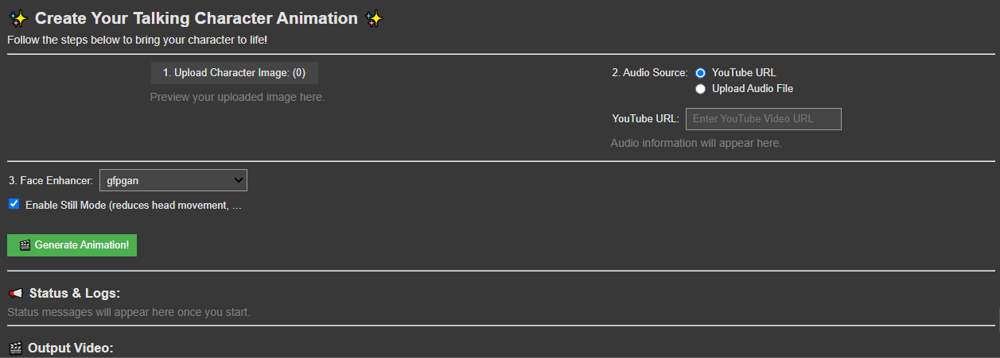

# 🎙️ Interactive Lipsync & Blinking Animator (LipsyncBlinking-AI) 🖼️ 
A Google Colab tool for creating lipsync and blinking animations from a still image and audio. Uses the SadTalker AI model. Features a user-friendly UI for easy input and video generation. Perfect for bringing characters to life!

Bring your characters to life! This Google Colab notebook provides a simple, interactive interface to generate talking head animations with realistic lip synchronization and natural eye blinking. It leverages the powerful pre-trained **SadTalker AI model**.

**No complex setup or model training required!** Just upload your image, provide audio, and let the AI do the magic.

## ✨ UI Overview

The tool provides a clean interface to manage your inputs and generate animations:

*(Image: `ui_overview.PNG` provided by user)*

*Caption: Main interface for uploading your character image, providing audio (via YouTube URL or file upload), selecting face enhancement options, and generating the animation.*

## 🌟 Features

* **User-Friendly UI:** Simple controls built with `ipywidgets` directly in Google Colab.
* **Still Image Input:** Upload any character's portrait or image.
* **Flexible Audio Input:**
    * Paste a YouTube URL (audio will be extracted automatically).
    * Upload your own audio file (e.g., `.wav`, `.mp3`).
* **High-Quality Animation:** Powered by SadTalker for realistic lipsync and blinking.
* **Face Enhancement:** Optional face enhancement using GFPGAN or RestoreFormer.
* **Still Mode:** Option to reduce head movement, ideal for portrait-style animations.
* **Instant Preview:** View the generated video directly in the notebook.
* **Easy Download:** Download your animated video.

## 🚀 How to Use

1.  **Open in Colab:**
    * Click the "Open in Colab" badge above.
    * Or, go to [Google Colab](https://colab.research.google.com/) and upload the `.ipynb` notebook file from this repository.
2.  **Run Setup Cell:**
    * Execute the first code cell (labeled "**Step 1: Setup Environment**").
    * This will clone the SadTalker repository, install all necessary dependencies, and download the pre-trained AI models.
    * **This step might take a few minutes**, especially on the first run. Please be patient! You'll see a "✅ Setup Complete!" message when it's done.
    * Ensure your Colab runtime has a **GPU enabled** for faster processing (`Runtime` > `Change runtime type` > `Hardware accelerator` > `GPU`).
3.  **Upload Inputs & Configure (Step 2 UI Cell - See UI Overview Image Above):**
    * Once setup is complete, run the second code cell (labeled "**Step 2: Upload Your Character & Audio, then Animate!**"). This will display the interactive UI.
    * **1. Upload Character Image:** Click the "Upload Character Image" button and select your desired image file (e.g., JPG, PNG). A preview will appear.
    * **2. Provide Audio Source:**
        * Choose "YouTube URL" and paste the link.
        * OR choose "Upload Audio File" and upload your `.wav` or `.mp3` file. Audio controls will appear if the file is valid.
    * **3. Select Face Enhancer:** Choose an option like 'gfpgan' for better facial clarity in the output, or 'None'.
    * **Enable Still Mode (Optional):** Check this box if you want minimal head movement (recommended for static portraits).
4.  **Generate Animation:**
    * Click the "🎬 **Generate Animation!**" button.
    * The "Status & Logs" section will show progress updates. This process can take a few minutes depending on the audio length and selected options.
5.  **View & Download:**
    * Once complete, the generated video will appear in the "Output Video" section.
    * A download link for the video will also be provided.

## 🔧 Behind the Scenes

* **SadTalker:** This project uses the [SadTalker (CVPR 2023)](https://github.com/OpenTalker/SadTalker) model, which synthesizes a talking head video from a single image and an audio track. It excels at producing natural facial expressions, including blinks and head movements that synchronize with the audio.
* **`yt-dlp`:** Used for extracting audio from YouTube URLs.
* **`ffmpeg`:** For audio processing.
* **`ipywidgets`:** For creating the interactive UI components in Colab.

## 🤝 Contributing

While this is a self-contained Colab tool, suggestions for improving the UI, adding more SadTalker parameter controls, or enhancing error handling are welcome!
1.  Fork the repository.
2.  Create your feature branch (`git checkout -b feature/AmazingFeature`).
3.  Commit your changes (`git commit -m 'Add some AmazingFeature'`).
4.  Push to the branch (`git push origin feature/AmazingFeature`).
5.  Open a Pull Request.

## 📜 License

This project is licensed under the MIT License - see the `LICENSE.md` file for details (you'll need to add one). The underlying SadTalker model has its own license, which you should also respect.

## 🙏 Acknowledgements

* The authors of [SadTalker](https://sadtalker.github.io/) for their incredible work and open-sourcing their model.
* The developers of the various Python libraries used in this project.

---

Enjoy creating your animations!
